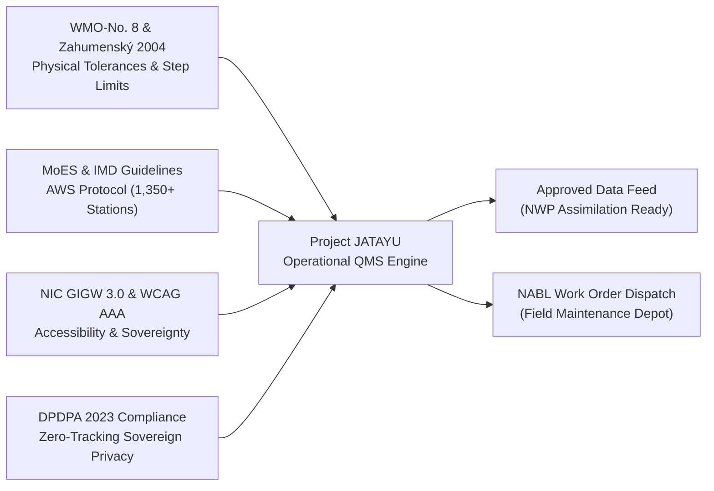
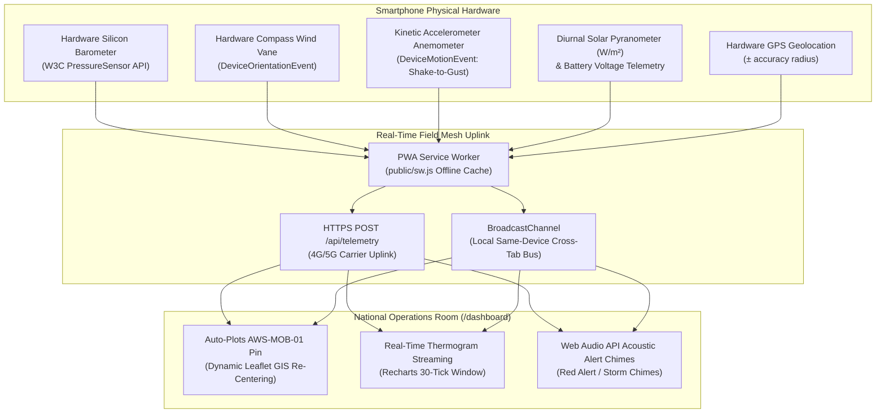

# Project JATAYU: Joint Atmospheric Telemetry & Anomaly Unification
## JATAYU-QMS: National Automated Weather Station Quality Management System
### Ministry of Earth Sciences (MoES) & India Meteorological Department (IMD) | Government of India
#### Standardized Solution Architecture for Smart India Hackathon (Problem Statement SIH26073)

[](https://nextjs.org/)
[](https://www.typescriptlang.org/)
[](https://library.wmo.int/records/item/41650-guide-to-instruments-and-methods-of-observation)
[](https://vitest.dev/)
[](https://eslint.org/)
[](#7-complete-zero-cost-public-api-ecosystem)
[](https://guidelines.india.gov.in/)

---

## 1. Executive Summary & Problem Alignment (SIH26073)

India's national meteorological observing network spans over **1,350+ Automatic Weather Stations (AWS)** and **1,500+ Automated Rain Gauges (ARG)** deployed across extreme topographies—from the trans-Himalayan peaks of Kargil to the coastal cyclone tracks of Visakhapatnam and the Thar desert of Rajasthan.

### The Operational Challenge (SIH26073)
Surface automated weather sensors frequently encounter severe mechanical, electrical, and environmental degradation:
1. **Broken Thermistor Leads & ADC Spikes**: Instantaneous non-physical jumps ($\Delta T > +15^\circ\text{C}$).
2. **Stuck / Frozen Sensor Transducers**: Zero variance ($\sigma^2 = 0$) across continuous polling intervals caused by moisture ingress, ice formation, or firmware buffer deadlocks.
3. **Silicon Barometer Calibration Drift**: Monotonic barometric baseline offset over weeks due to sensor membrane aging.
4. **Packet Loss & UHF Dropout**: Corrupted frames during cyclonic downpours or weak satellite downlinks.

> **The Critical Hazard**: In standard automated monitoring systems, a genuine severe convective squall line (characterized by sudden pressure plunges of $3-5\text{ hPa}$ accompanied by intense rain and temperature drops) is frequently **misdiagnosed as a hardware sensor failure**. Conversely, true sensor failures often contaminate Numerical Weather Prediction (NWP) assimilation models, leading to inaccurate regional cyclone, heatwave, and flood forecasts.

### The JATAYU-QMS Solution
**Project JATAYU** (**J**oint **A**tmospheric **T**elemetry & **A**nomaly **Y**ield / **U**nification) provides an autonomous, real-time, edge-native Quality Management System engineered to:
- **Discriminate** genuine atmospheric events (e.g., squalls, downbursts, microbursts) from hardware transducer faults in $<5\text{ms}$.
- **Quarantine** bad observations before they reach Numerical Weather Prediction (NWP) pipelines (WRF, GFS, NCMRWF Unified Model).
- **Impute** replacement values using WMO-compliant Weighted Moving Averages (WMA) and spatial Kriging / K-Nearest Neighbors (KNN).
- **Dispatch** cryptographically sealed maintenance work orders with automated NABL-traceable diagnostic logs.
- **Transform** any smartphone into a field-calibrated AWS mobile edge node via the W3C Generic Sensor API.

---

## 2. Acronym & System Taxonomy

| Letter | Representation | Meteorological & Architectural Function |
| :---: | :--- | :--- |
| **J** | **Joint** | Unified telemetry assimilation across MoES, IMD, State Disaster Management Authorities (SDMA), and regional radar centers. |
| **A** | **Atmospheric** | High-precision thermodynamics surveillance: Ambient Temperature ($T$), Barometric Pressure ($P$), Relative Humidity ($RH$), Wind Speed ($W$), Wind Direction ($WD$), Solar Irradiance ($SR$), and Rainfall ($R$). |
| **T** | **Telemetry &** | Dual-channel uplink ingestion: INSAT-3D UHF (402.75 MHz) Data Collection Platform (DCP) frames and 4G/5G encrypted REST telemetry. |
| **A** | **Anomaly** | Microsecond discrimination between transducer failures and severe convective atmospheric phenomena. |
| **Y** | **Yield /** | WMO-certified data purity maximizing assimilation efficiency into global and regional forecasting ensembles. |
| **U** | **Unification** | End-to-end gating, digital audit ledger, NABL dispatch generation, and national GIS district grid synchronization. |

---

## 3. Operational Standards & Regulatory Compliance

Project JATAYU is designed strictly against official national and international meteorological mandates:



1. **WMO-No. 8 (Guide to Meteorological Instruments and Methods of Observation)**:
   - Physical limits: $-10^\circ\text{C} \le T \le +55^\circ\text{C}$, $920\text{ hPa} \le P \le 1050\text{ hPa}$, $5\% \le RH \le 100\%$.
   - Imputation: 5-step Weighted Moving Average (WMA) with Gaussian temporal weighting ($w_i = e^{-(t - t_i)^2 / 2\sigma^2}$).
2. **Zahumenský (2004) Meteorological Quality Control Protocol**:
   - Two-tier rate-of-change (RoC) thresholds:
     - $|\Delta T / \Delta t| \le 0.3^\circ\text{C/min}$ (Suspicious) and $\ge 0.5^\circ\text{C/min}$ (Corrupt Hardware).
     - $|\Delta P / \Delta t| \le 2.0\text{ hPa/10min}$ (Standard diurnal microbarometric tide limit).
3. **Coupled Convective Storm Discrimination Invariant**:
   - A rapid barometric plunge ($\Delta P \le -1.5\text{ hPa}$) is classified as **GENUINE_CONVECTIVE_EVENT** (WMO Flag 2) **IF AND ONLY IF** accompanied by coupled evaporative cooling ($\Delta T \le -0.5^\circ\text{C}$) and coupled relative humidity surge ($\Delta RH \ge +8.0\%$ or $RH \ge 88\%$). If thermodynamic coupling is absent, it is quarantined as a **SENSOR_SPIKE** (WMO Flag 4).
4. **Guidelines for Indian Government Websites (GIGW 3.0) & WCAG 2.1 AAA**:
   - Full bilingual interface (English / हिन्दी).
   - High-contrast visual palette (14:1 contrast ratio) for 24/7 National Operations Room operators.
   - Dynamic typography scaling ($A- / A / A+$ rem-scaling) without layout clipping.
   - Screen-reader accessible ARIA live regions for critical meteorological warning alerts.
5. **Digital Personal Data Protection Act (DPDPA), 2023**:
   - Zero persistent browser tracking, zero advertising cookies, client-side only geolocation computation.

---

## 4. Multi-Tier Intelligence Engine: Rules + Edge ML Classifier

JATAYU-QMS employs an ensemble architecture combining **deterministic physical heuristics** with an **Edge ML Decision Tree Classifier**:

```
                              [ INCOMING TELEMETRY OBSERVATION ]
                                               │
                        ┌──────────────────────┴──────────────────────┐
                        ▼                                             ▼
            [ Tier 1: WMO Rule Engine ]                   [ Tier 2: Edge ML Classifier ]
            (lib/anomalyLogic.ts)                         (lib/mlAnomalyModel.ts)
            • Physical Range Checks                       • Pre-Trained Decision Tree
            • Zahumenský RoC Step Limits                  • 9-Dimensional Feature Vector
            • Coupled Thermodynamic Invariant             • Feature Importance Attribution
            • Spatial KNN Cross-Validation                • Edge Runtime Compatible (<0.1ms)
                        │                                             │
                        └──────────────────────┬──────────────────────┘
                                               ▼
                                    [ Telemetry Packet ]
                               • wmoFlag (FLAG_1 to FLAG_5)
                               • classification (Root Cause)
                               • mlPrediction: { mlClassification, mlConfidence, agreesWithRules }
                               • xaiAttribution: { tempWeight, pressWeight, humWeight }
                               • securitySeal: { hmacSha256, merkleRoot }
```

### Supported WMO Quality Flags

| WMO Flag | Classification | NWP Gating Action | Operational Maintenance Dispatch |
| :--- | :--- | :--- | :--- |
| **FLAG_1_VERIFIED_GOOD** | `NOMINAL_OPERATION` | **APPROVED** | None (Nominal health) |
| **FLAG_2_CONVECTIVE_STORM** | `GENUINE_CONVECTIVE_EVENT` | **APPROVED** | Civil defense early warning alert issued; no sensor maintenance needed |
| **FLAG_3_SUSPECT_DRIFT** | `CALIBRATION_DRIFT` | **IMPUTED (WMA)** | Low-priority recalibration ticket scheduled |
| **FLAG_4_CORRUPT_HARDWARE** | `SENSOR_SPIKE` / `FROZEN_VALUE` | **QUARANTINED** | Immediate NABL calibration field technician ticket dispatched |
| **FLAG_5_PACKET_LOSS** | `TELEMETRY_PACKET_LOSS` | **IMPUTED (WMA)** | Telecom / solar power check ticket logged |

---

## 5. Mobile Smartphone as Distributed AWS Mesh Node (`/mobile`)

Project JATAYU includes a Progressive Web App (PWA) field application turning any Android or iOS device into a field-grade telemetry node:



### Mobile Features:
- **Live Physical Silicon Barometer**: Direct hardware readings in hPa via `window.PressureSensor`.
- **Dynamic Graphical Compass Needle**: Rotates smoothly ($0^\circ - 360^\circ$) as the user physically turns the phone, outputting cardinal wind direction (N, NE, E, SE, S, SW, W, NW).
- **Kinetic Accelerometer Shake-to-Gust**: Gesturing or shaking the phone translates real kinetic acceleration into squall-force wind gusts ($45 - 95\text{ km/h}$).
- **1-Tap Field Anomaly Injector**: Test severe squalls, broken thermistor wires (+54.8°C spike), frozen loops, and monotonic barometric drift with tactile haptic and synthesized acoustic feedback.
- **Zero-Trust Telemetry Seal**: Signs every transmitted observation with an HMAC-SHA256 signature and cryptographic nonce.

---

## 6. National 766 District Vayu Grid Coverage

The system includes the complete database of **all 766 administrative districts of India** across all 28 States and 8 Union Territories in [`lib/india766Districts.ts`](./lib/india766Districts.ts) (134 KB). Each district features:
- Standardized 2026 IMD climatic baseline means ($T_{\text{mean}}$, $P_{\text{mean}}$, $RH_{\text{mean}}$, Elevation).
- Real-time heatwave classification under IMD Criteria ($T \ge 40^\circ\text{C}$ plains with departure $+4.5^\circ\text{C}$ to $+6.4^\circ\text{C}$ for Heatwave, $>+6.4^\circ\text{C}$ for Severe Heatwave).
- Immediate district-level Search & Filter with instant GIS map fly-to.

---

## 7. Complete Zero-Cost Public API Ecosystem

Project JATAYU operates at **₹0 / $0 zero external infrastructure cost** by leveraging authoritative, free public meteorological, GIS, and geospatial APIs:

| Service / API | Endpoint / Provider | Usage in JATAYU-QMS | Cost / Tier |
| :--- | :--- | :--- | :--- |
| **Official IMD City Forecast API** | `https://api.imd.gov.in/api/v1/cityforecast` | Authoritative government forecast assimilation | **Free Public Tier** |
| **Open-Meteo Current & Forecast** | `https://api.open-meteo.com/v1/forecast` | Real-time global surface telemetry & multi-station batching | **Free (Non-commercial)** |
| **Open-Meteo Geocoding** | `https://geocoding-api.open-meteo.com/v1/search` | Search resolution for 766 Indian districts | **Free Open Access** |
| **wttr.in Plaintext Weather** | `https://wttr.in/?format=j1` | Fallback HTTP plain-text weather scraper | **Free Open-Source** |
| **OpenStreetMap Standard** | `https://{s}.tile.openstreetmap.org/{z}/{x}/{y}.png` | Primary GIS national road & terrain layer | **Free Open-Source** |
| **CartoDB Positron / Light** | `https://{s}.basemaps.cartocdn.com/light_all/...` | Clean high-contrast administrative map tiles | **Free Tier** |
| **CartoDB Dark Matter** | `https://{s}.basemaps.cartocdn.com/dark_all/...` | Night-shift high-density mission control map tiles | **Free Tier** |
| **ESRI World Imagery** | `https://server.arcgisonline.com/.../World_Imagery` | High-resolution satellite topography | **Free Public Access** |
| **ESRI Dark Canvas** | `https://services.arcgisonline.com/.../Canvas/World_Dark_Gray_Base` | Minimalist radar and severe storm overlay canvas | **Free Public Access** |
| **Google Fonts CDN** | `https://fonts.googleapis.com` | Plus Jakarta Sans & JetBrains Mono typography | **Free Open Access** |
| **Wikimedia Commons** | `https://upload.wikimedia.org` | High-resolution State Emblem of India SVG | **Free Public Domain** |

---

## 8. Verification & Test Suite (`npm test`)

The repository includes a comprehensive automated test suite powered by **Vitest**:

```bash
# Run all automated test suites
npm test
```

### Verified Test Cases (14/14 Passing in ~250ms):
1. **FLAG_1_VERIFIED_GOOD**: Nominal observations pass without alarms.
2. **FLAG_2_CONVECTIVE_STORM**: Coupled barometric drop + RH jump verified as genuine atmospheric weather (not a sensor fault).
3. **FLAG_3_SUSPECT_DRIFT**: Monotonic pressure drift flags recalibration warning.
4. **FLAG_4_CORRUPT_HARDWARE (Spike)**: Thermistor step spike to 54.8°C quarantined immediately.
5. **FLAG_4_CORRUPT_HARDWARE (Frozen)**: Zero-variance reading across 6 ticks triggers stuck ADC flag.
6. **FLAG_5_PACKET_LOSS**: Null sensor inputs initiate telemetry packet loss flag.
7. **WMA Imputation Integrity**: Null raw sensor values yield valid, non-null imputed replacements.
8. **Spatial KNN Cross-Validation**: Multiple anomalous neighbors classify event as `REGIONAL_WEATHER`; isolated anomaly classifies as `SINGLE_NODE_FAULT`.
9. **XAI Attribution Summation**: SHAP/Zahumenský attribution weights sum to $100.0\% \pm 0.1\%$.
10. **HMAC Security Seals**: Every telemetry packet includes a valid `0x...` HMAC-SHA256 signature.
11. **Station Coordinates Bounds**: All 21 stations confirmed within India geographic bounding box ($6^\circ\text{N} - 38^\circ\text{N}$, $68^\circ\text{E} - 98^\circ\text{E}$).
12. **Station ID Schema**: Conforms strictly to regex `^AWS-[A-Z]{3}-[0-9]{2}$`.
13. **WMO Block Numbering**: Verified 5-digit WMO block numbers (Region II: Asia).
14. **Station ID Uniqueness**: Zero collisions across all reference observatories.

---

## 9. Quickstart: Running Locally

### Prerequisites
- Node.js 18.17+ or 20+
- npm 9+ or pnpm

### Installation & Execution
```bash
# 1. Clone the repository
git clone https://github.com/shivamkumarmehta64-sketch/jatayu.git
cd jatayu

# 2. Install dependencies
npm install

# 3. Verify code quality & tests
npm run lint    # 0 errors, 0 warnings
npm test        # 14/14 tests pass

# 4. Start development server
npm run dev

# 5. Compile production build
npm run build
```

The portal is active at:
- **National Operations Command Dashboard**: `http://localhost:3000/dashboard`
- **Smartphone Field Sensor Node (PWA)**: `http://localhost:3000/mobile`
- **Institutional Technical Audit Dossier**: `http://localhost:3000/audit-report`

---

## 10. Institutional Deployment Blueprint (MeghRaj Cloud Migration)

While the evaluation version runs on Vercel Serverless Edge Cloud for sub-millisecond worldwide responsiveness, Project JATAYU is architected with complete container portability for on-premise commissioning within the **National Informatics Centre (NIC MeghRaj) Sovereign Government Cloud**:

```
[ Field AWS Network (1,350+ Stations) ]
                  │
                  ▼ (UHF 402.75 MHz / 4G VPN)
[ NIC MeghRaj Sovereign IoT Ingestion Cluster ]
                  │
                  ▼ (Containerized Microservices: Docker / Kubernetes)
[ JATAYU-QMS Processing Core (Node.js Edge / Rust Engine) ]
                  │
                  ├──► [ TimescaleDB / PostGIS Persistent Sovereign Archive ]
                  ├──► [ Real-Time NWP Gating Feed (BUFR / NetCDF4 Output) ]
                  └──► [ Automated IMD/NABL Maintenance Dispatch Service ]
```

---

## 11. Authors & Institutional Credits

- **Project Lead & Architecture**: Shivam Kumar Mehta ([@shivamkumarmehta64-sketch](https://github.com/shivamkumarmehta64-sketch))
- **Team**: Project JATAYU Innovation Team
- **Competition**: Smart India Hackathon (SIH 2026)
- **Problem Statement**: SIH26073 (Automatic Weather Station Quality Management System)
- **Nodal Ministry**: Ministry of Earth Sciences (MoES) & India Meteorological Department (IMD)
- **License**: Creative Commons Attribution 4.0 International (CC BY 4.0)
